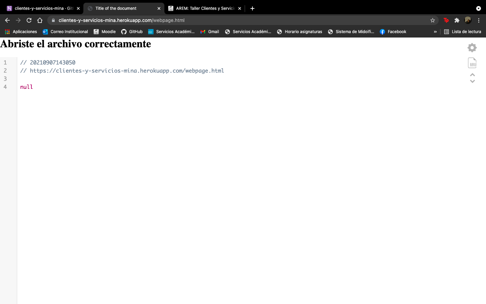
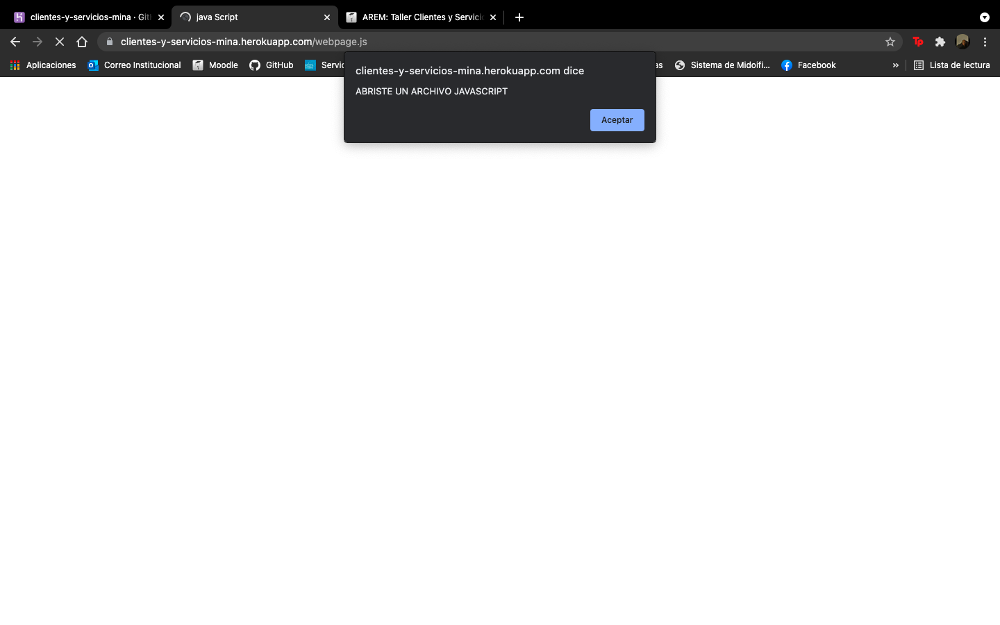
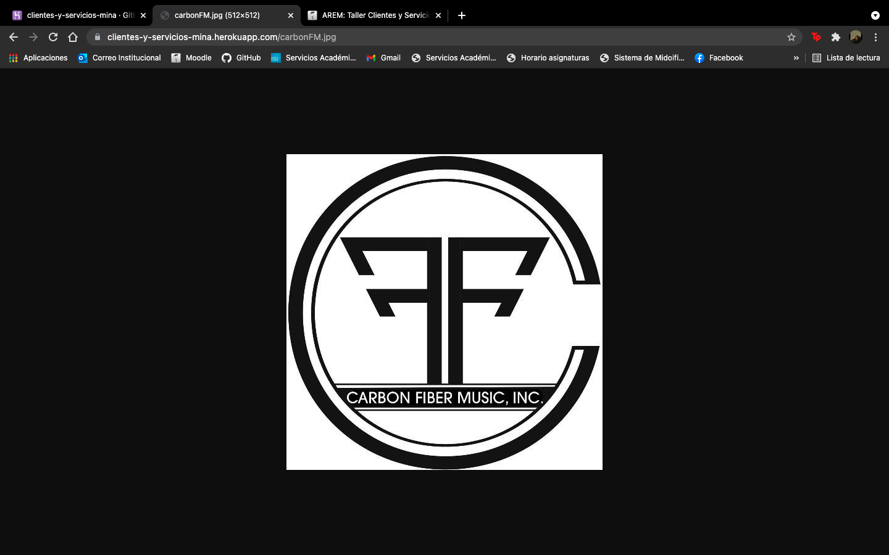
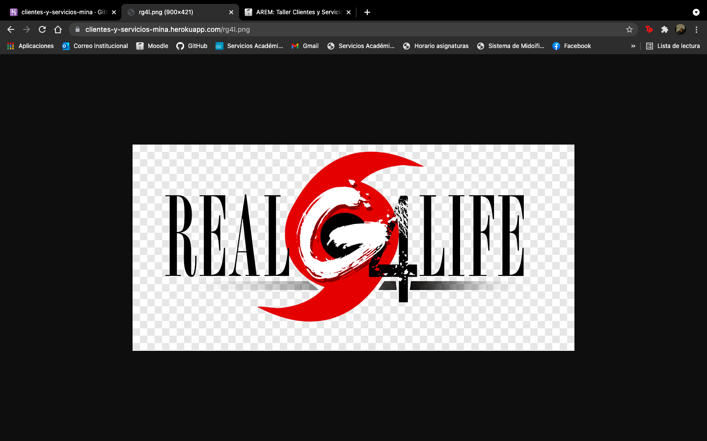

# AREP-TALLER-CLIENTES-Y-SERVICIOS (RETO 1)

>Escriba un servidor web que soporte múlltiples solicitudes seguidas (no concurrentes). El servidor debe retornar todos los archivos solicitados, incluyendo páginas html e imágenes. Construya un sitio web con javascript para probar su servidor. Despliegue su solución en Heroku. NO use frameworks web como Spark o Spring use solo Java y las librerías para manejo de la red.

### Pre-requisitos

> Para  elaborar este proyecto requeimos de dos tecnologias:
> * [Maven](https://es.wikipedia.org/wiki/Maven): Herramienta la cual permite realizar la construción de proyectos, realizarles pruebas y otras funciones.
> * [Git](https://es.wikipedia.org/wiki/Git): Software de control de versionamiento centralizado.

## Construido con

* [Maven](https://maven.apache.org/): Herramienta que se encarga de estandarizar la estructura física de los proyectos de software, maneja dependencias (librerías) automáticamente desde repositorios y administra el flujo de vida de construcción de un software.
* [GIT](https://git-scm.com/): Sistema de control de versiones que almacena cambios sobre un archivo o un conjunto de archivos, permite recuperar versiones previas de esos archivos y permite otras cosas como el manejo de ramas (branches).
* [Java](https://www.oracle.com/java/): Lenguaje de programación de propósito general, es decir, que sirve para muchas cosas, para web, servidores, aplicaciones móviles, entre otros. Java también es un lenguaje orientado a objetos, y con un fuerte tipado de variables.

## Desplegado en Heroku

- Para abrir un archivo html: https://clientes-y-servicios-mina.herokuapp.com/webpage.html

- Para abrir un archivo js: https://clientes-y-servicios-mina.herokuapp.com/webpage.js

- Para abrir un archivo jpg: https://clientes-y-servicios-mina.herokuapp.com/carbonFM.jpg

- Para abrir un archivo png: https://clientes-y-servicios-mina.herokuapp.com/rg4l.png

## Autor 

[Sebastián Mina](https://github.com/sebastianmina)

## Licencia & Derechos de Autor
**©** Sebastián Mina, Estudiante de Ingeniería de Sistemas de la Escuela Colombiana de Ingeniería Julio Garavito

Licencia bajo la [GNU General Public License](https://github.com/sebastianmina/AREP-TALLER-CLIENTES-Y-SERVICIOS/blob/main/LICENSE.txt).
